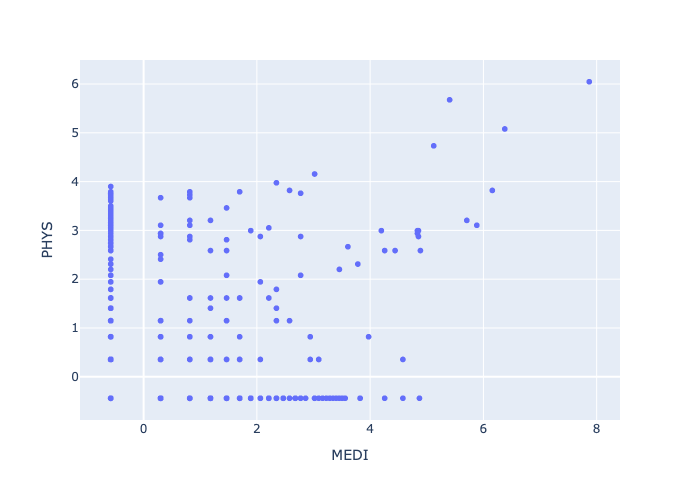
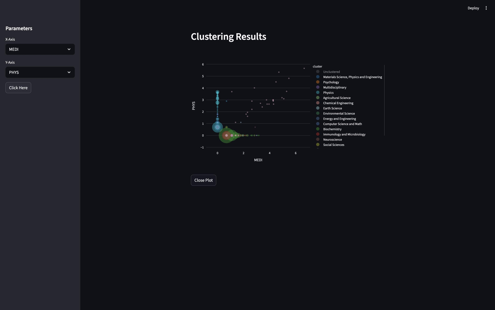

# Chatters' Grant-PT

**Grant-PT**, also known as _GPT_, is a clustering project made for the **219051
DATA SCIENCE** subject using the Scopus dataset.



## Group Members

1. Warit Suntrarom #6738233121
2. Phukla Jeerawattana #6738159421
3. Porrapat Lomsomboon #6738137621
4. Yanathep Prasitsomsakul #6738067321

_<sup>"ChatGPT is all you need." - Some Article</sup>_

## Using Conda & Pip

_Inside_ the project directory (`cd` into the project directory first if using Conda Prompt), in order to create the virtual environment, use
this command (in the Conda Prompt if on Windows).

```bash
conda env create --prefix ./env --file environment.yml
```

The env/ folder is ignored by Git, recreate it using `environment.yml`, This
installs all the necessary dependencies as depicted in the file, then use the
command below to activate the virtual environment.

```bash
conda activate ./env
```

## Opening up the applications

If there are problems with running the Jupyter Notebooks, make sure you set the
Python Interpreter to `env`. And if the problems are caused by Plotly not
detecting Google Chrome, run the code in `get_chrome.ipynb`. (This installs
Google Chrome for Testing inside the virtual environment)

There will be a gap in the data which is the raw data, get it by following the instructions of `combine.js` or if there is already a combined file for each year, simply use that. The other files will not touch the uncombined raw data.

** **IMPORTANT: DO NOT OPEN THE COMBINED FILE WITH VSCODE OR ANY TEXT EDITOR! The files are extremely large.**

You should be able to run the FastAPI file by activating the uvicorn server.

```bash
uvicorn src.api.app:app --reload
```

To use streamlit, open a new terminal simultaneously with the FastAPI.

```bash
streamlit run src/visualization/dashboard.py
```

After selecting the X and Y subject areas from the sidebar, and clicking on
"Click Here" (This button requests to the backend), you should get a result
similar to this. (Unclustered cluster removed for simplicity)



## Contribution

When contributing to the project, please make sure to alias your `import`s
according to this system, with standard library imports first, then dependencies
second, then local files third:

```python
import datetime as dt  # However, always prefer pd.Timestamp.
import pickle
from pathlib import Path

import numpy as np
import pandas as pd
import plotly.express as px
import streamlit as st
from sklearn.preprocessing import StandardScaler
from fastapi import FastAPI

from utils import DATA_DIR
```

If the extension _Markdown Lint_ is linting the use of the HTML tags, add this
into your `settings.json`:

```json
  "markdownlint.config": {
    "MD033": false
  }
```
